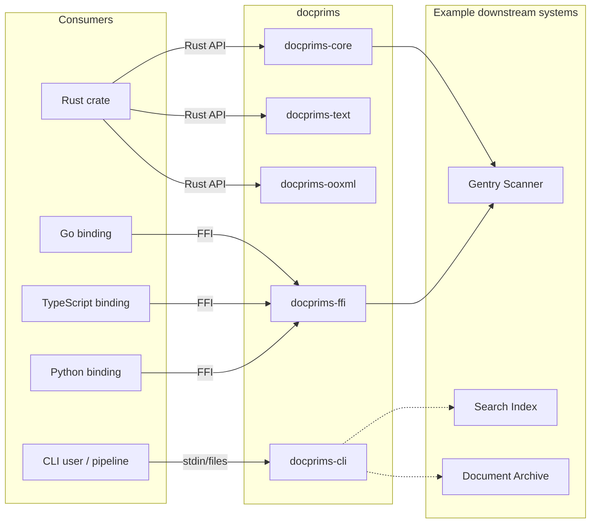
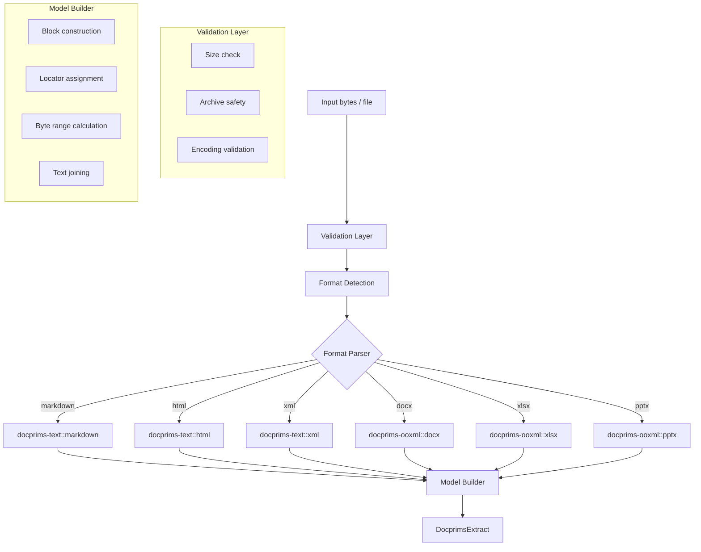

# docprims Architecture Overview

This document captures the stable architectural intent of docprims: the parts we expect consumers and maintainers to rely on.

It is deliberately not a roadmap. Future ideas are described only as optional extension points.

## What docprims Is

docprims is a Rust library (with CLI + FFI bindings) that extracts text from documents into a stable, schema-validated structured representation.

**Primary consumer (initial)**: Gentry (content scanning) needs reliable text + provenance anchors to build deterministic context windows and findings.

**Key capabilities**:
- Extract text from OOXML (DOCX/XLSX/PPTX), HTML, Markdown, XML
- Preserve provenance (where did each piece of text come from?)
- Emit structured output with byte-range anchors for downstream chunking
- Handle untrusted input safely (size limits, malformed document handling)

## What docprims Is Not

- Not a renderer (no layout fidelity, fonts, or coordinates as a requirement).
- Not an editor of source documents.
- Not an OCR engine.
- Not a general document conversion suite.
- Not a full-text search indexer (but can feed one).

## Design Principles

| Principle | Rationale | Reference |
|-----------|-----------|-----------|
| Defensive parsing | Untrusted input is the norm | ADR-0003 |
| Schema-driven contracts | Consumers need stability guarantees | `schemas/v0/extract/` |
| Minimal core dependencies | Keep docprims-core embeddable | ADR-0002 |
| CLI composability | Stdout purity for pipelines | ADR-0004 |
| GPL-free license policy | Safe for commercial embedding | ADR-0001 |

## System Context



## Workspace and Boundaries

Crate structure follows `docs/decisions/ADR-0002-crate-structure.md`.

```
docprims/
├── crates/
│   ├── docprims-core/      # Shared types, traits, errors, structured model
│   ├── docprims-text/      # Markdown, HTML, XML extraction
│   ├── docprims-ooxml/     # DOCX, XLSX, PPTX extraction
│   └── docprims-cli/       # CLI binary
├── ffi/
│   └── docprims-ffi/       # C-ABI for language bindings
├── bindings/
│   ├── go/                 # Go wrapper (v0.2+)
│   ├── typescript/         # TypeScript/Node wrapper (v0.2+)
│   └── python/             # Python wrapper (v0.2+)
└── schemas/
    └── v0/                 # JSON schemas for contracts
```

### Crate Responsibilities

**docprims-core**:
- `DocprimsExtract` - the top-level extraction result
- `DocprimsBlock`, `DocprimsLocation` - structured content model
- `DocprimsError` - unified error types
- `ExtractLimits` - resource limits and configuration
- `ExtractionQuality` - complete vs partial extraction status
- No format-specific parsing logic

**docprims-text**:
- `markdown::extract()` - strip or preserve markdown syntax
- `html::extract()` - strip tags, decode entities, preserve structure
- `xml::extract()` - extract text nodes with element context
- Locator hints (v0: block index; optionally line-based where feasible)

**docprims-ooxml**:
- `docx::extract()` - paragraphs, tables, lists, headers/footers
- `xlsx::extract()` - cells with shared string resolution, sheet enumeration
- `pptx::extract()` - slide text, speaker notes
- ZIP archive handling with security controls
- XML namespace handling for Office namespaces

**docprims-cli**:
- `docprims extract <file>` - unified extraction command
- Format auto-detection
- JSON and plain text output modes
- Stdin/stdout composability

**docprims-ffi**:
- C-ABI exports: `docprims_extract()`, `docprims_extract_bytes()`
- Memory management: `docprims_free_string()`
- JSON-encoded results for cross-language compatibility

## Primary Output Contract: `DocprimsExtract`

The stable contract for machine consumption is a single JSON payload per extracted document.

### Top-Level Structure

```json
{
  "schema_id": "https://schemas.3leaps.dev/docprims/extract/v0/docprims-extract.schema.json",
  "schema_version": "1.0.0",
  "generator": { "name": "docprims", "version": "0.1.0" },
  "source": {
    "uri": "./report.docx",
    "format": { "family": "ooxml", "kind": "docx" },
    "sha256": "0000000000000000000000000000000000000000000000000000000000000000"
  },
  "document": {
    "quality": { "status": "complete" },
    "text": "Full extracted text joined from blocks...",
    "blocks": [ /* Block[] */ ],
    "metadata": { /* optional DocumentMetadata */ },
    "warnings": [ /* non-fatal issues */ ]
  }
}
```

### Key Properties

| Field | Purpose |
|-------|---------|
| `schema_id` | Canonical schema identifier for routing and compatibility |
| `schema_version` | Contract version (semver) for consumer compatibility |
| `source.format` | Family (`text`, `ooxml`, `pdf`) + kind (`docx`, `html`, etc.) |
| `document.text` | Full joined text with deterministic newline joining |
| `document.blocks` | Sequence of blocks in reading order with byte ranges |
| `document.quality` | `complete` or `partial { reason }` |

The schema files live in-repo under `schemas/v0/extract/` and are validated via CI and golden fixtures.

## Block and Span Model

Blocks are the primary unit for consumer scanning, context windows, and provenance anchoring.

### Block Structure

```json
{
  "id": "docx:p:0",
  "kind": "docx:paragraph",
  "text": "Hello World",
  "doc_text_range": { "start_byte": 0, "end_byte": 11 },
  "role": "body",
  "loc": { /* Location */ }
}
```

### Block Kinds (v0.1.0)

| Family | Kind | Description |
|--------|------|-------------|
| text | `markdown:heading` | Markdown heading |
| text | `markdown:paragraph` | Markdown paragraph |
| text | `markdown:list_item` | Markdown list item |
| text | `markdown:code` | Markdown code block |
| text | `html:heading` | HTML heading (`h1..h6`) |
| text | `html:paragraph` | HTML paragraph (`p`) |
| text | `html:list_item` | HTML list item (`li`) |
| text | `html:code` | HTML code/preformatted (`pre`) |
| text | `html:blockquote` | HTML blockquote (`blockquote`) |
| text | `xml:text` | XML logical text block |
| ooxml | `docx:paragraph` | Word paragraph |
| ooxml | `xlsx:row` | Spreadsheet row (tab-joined cells) |
| ooxml | `pptx:paragraph` | Slide paragraph text |

Block kinds are namespaced (`family:name`) to allow extensibility.

### Spans (Planned)

Span annotations (bold/italic/links) are a likely future extension, but are not part of the current `schemas/v0/extract/` contract.

## Provenance and Locators

Every block includes a locator (`loc`) that answers: "where did this text come from?"

### Location Structure

```json
{
  "kind": "docx:locator",
  "container": {
    "kind": "archive",
    "path": "./report.docx",
    "part": "word/document.xml"
  },
  "hints": {
    "paragraph_index": 0
  }
}
```

### Format-Specific Locators

| Format | Locator Kind | Key Fields |
|--------|--------------|------------|
| Markdown | `markdown:locator` | `hints.block_index` (v0); optionally line-based when feasible |
| HTML | `html:locator` | `hints.dom_path` (recommended) or `hints.block_index` |
| XML | `xml:locator` | `hints.element_path` (recommended) or `hints.block_index` |
| DOCX | `docx:locator` | `paragraph_index`, `table_index`, `row_index`, `col_index` |
| XLSX | `xlsx:locator` | `sheet_name`, `sheet_index`, `row_index` (v0 uses row blocks) |
| PPTX | `pptx:locator` | `slide_index`, `paragraph_index` (v0 uses paragraph blocks) |

### Container Types

- `file`: Simple file source (`path` only)
- `archive`: ZIP-based formats (`path` + `part` for internal file)

### Stability Guarantee

Locators are stable within a single extraction result. Across document edits, indexes may drift but remain meaningful for the extraction that produced them.

## Dataflow



## Security Architecture

docprims is classified as **security-sensitive** because it parses untrusted input.

### Threat Model

| Threat | Mitigation |
|--------|------------|
| Zip bombs | Decompression ratio limits, file count limits |
| XML bombs (billion laughs) | Entity expansion disabled, depth limits |
| Path traversal | Archive path validation, no `..` allowed |
| Memory exhaustion | `max_input_bytes`, `max_output_bytes` limits |
| CPU exhaustion | `timeout_ms`, iteration limits |
| Malformed input crashes | `Result<T, Error>` everywhere, no panics on bad input |

### Resource Limits (ExtractLimits)

```rust
pub struct ExtractLimits {
    pub max_input_bytes: usize,
    pub max_output_bytes: usize,
    pub max_blocks: usize,
}
```

### Partial Extraction

When limits are hit, docprims can return partial results:

```json
{
  "document": {
    "quality": {
      "status": "partial",
      "reason": "Output truncated at 50MB limit"
    },
    "warnings": [
      "Skipped 3 large embedded images",
      "Table truncated after 1000 rows"
    ]
  }
}
```

See `docs/decisions/ADR-0003-input-validation-policy.md` for the full policy.

## CLI Contract

The CLI is a reference implementation and a composable Unix tool.

### Output Streams

| Stream | Content |
|--------|---------|
| stdout | Requested output only (plain text or JSON) |
| stderr | Diagnostics, logging, progress, help, version |

### Output Formats

```bash
# Plain text (default)
docprims extract report.docx

# JSON (DocprimsExtract schema)
docprims extract report.docx --format json

# NDJSON for multiple files (one JSON object per line)
docprims extract *.docx --format json

# JSON array for multiple files
docprims extract *.docx --format json --array
```

### Exit Codes

Exit codes are defined by the CLI implementation and are expected to follow the `rsfulmen` foundry conventions for data/usage failures.

See `docs/decisions/ADR-0004-stdout-purity.md` for the full contract.

## FFI + Bindings Contract

Bindings follow the sysprims pattern for cross-language FFI.

### C-ABI Surface (Illustrative; subject to change in v0)

```c
// Extract from file path, returns JSON string
char* docprims_extract(const char* path, const char* options_json);

// Extract from bytes, returns JSON string
char* docprims_extract_bytes(
    const uint8_t* data,
    size_t len,
    const char* options_json
);

// Free returned string
void docprims_free_string(char* ptr);

// Get last error as JSON
char* docprims_last_error(void);
```

Note: The stable requirement is the *pattern* (single JSON string for `DocprimsExtract`, explicit free function, and stable error reporting).
The exact symbol names and signatures should be treated as draft until they are finalized in code and reflected in the schema/contract briefs.
See `.plans/active/v0.1.0/03-cli-and-ffi-json-output-contract.md`.

### Return Format

Target state: FFI returns a single JSON string containing a `DocprimsExtract` payload on success.

### Binding Priorities

1. **Go** (v0.2+) - Primary integration language for Gentry
2. **TypeScript/Node** (v0.2+) - MCP server integration
3. **Python** (v0.2+) - Data science/notebook use cases

## Schema Versioning

### Two-Version Model

| Version | Location | Bump Rules |
|---------|----------|------------|
| Package version | `Cargo.toml` | Standard semver |
| Schema identifier | `schema_id` in output | Primary routing key |
| Schema version | `schema_version` in output | Contract semver (human-friendly) |

### Schema Version Bumps

| Change Type | Version Bump | Example |
|-------------|--------------|---------|
| Docs, examples, loosening constraints | Patch | `1.0.0` → `1.0.1` |
| New optional fields, new block kinds | Minor | `1.0.0` → `1.1.0` |
| Field removal, meaning changes, breaking constraints | Major | `1.0.0` → `2.0.0` |

### Schema Location

```
schemas/
└── v0/
    └── extract/
        ├── docprims-extract.schema.json
        ├── docprims-block.schema.json
        └── docprims-location.schema.json
```

During alpha (`v0.x`), schemas live under `schemas/v0/`. Post-1.0, schemas will be versioned independently.

## Testing Strategy (Contract First)

### Test Categories

| Category | Purpose | Location |
|----------|---------|----------|
| Unit tests | Parser logic, model construction | `src/**/*_test.rs` |
| Golden fixtures | Output stability across versions | `testdata/golden/` |
| Schema validation | Outputs conform to JSON schema | CI via rsfulmen |
| Malformed input | Parser safety on bad data | `testdata/malformed/` |
| Resource limits | Limits trigger correctly | `testdata/limits/` |

### Golden Test Pattern

```rust
#[test]
fn golden_simple_docx() {
    let result = extract_docx("testdata/golden/simple.docx").unwrap();
    let expected: DocprimsExtract = load_golden("testdata/golden/simple.docx.json");
    assert_eq!(result, expected);
}
```

Golden outputs are committed to the repo and validated in CI.

## Consumer Integration: Gentry

Gentry is the primary consumer driving docprims requirements.

### Gentry's Needs

| Need | docprims Response |
|------|-------------------|
| Text for pattern matching | `document.text` - full joined text |
| Context windows for AI | `block.doc_text_range` - byte offsets for slicing |
| Finding attribution | `block.loc` - precise source location |
| Partial scan support | `document.quality` - graceful degradation |
| Cross-format consistency | Unified `DocprimsExtract` schema |

### Integration Pattern

```rust
// Gentry scanning flow
let extract = docprims::extract(&document_bytes, &options)?;

for finding in pattern_engine.scan(&extract.document.text) {
    // Map finding byte range back to a block
    let block = find_block_for_range(&extract.document.blocks, finding.range);

    // Get source location for the finding
    let location = &block.loc;

    // Extract context window for AI coaching
    let context = extract_context(&extract.document.text, finding.range, 200);

    emit_sarif_result(finding, location, context);
}
```

## Extension Points (Non-Commitments)

These are ways the architecture can evolve without changing the core intent:

### Future Format Support

- **PDF** (`docprims-pdf`) - Complex; deferred to v0.2+
- **RTF** (`docprims-text::rtf`) - If demand exists
- **ODF** (`docprims-odf`) - OpenDocument formats

All future formats emit `DocprimsExtract` with format-specific block kinds and locators.

### Optional Derivatives

Document derivative tooling (copy + redact) that produces new artifacts without modifying originals. This should be a separate crate/module so docprims-core remains small.

### Streaming API

For very large documents, a streaming extraction API that emits blocks incrementally rather than building the full `DocprimsExtract` in memory.

## Dependency Philosophy

### Core Dependencies (docprims-core)

Minimal: `serde`, `thiserror`, `time`. No format-specific dependencies.

### Format Dependencies (permissive licenses only)

| Crate | License | Purpose |
|-------|---------|---------|
| `quick-xml` | MIT | XML parsing |
| `zip` | MIT | ZIP archive handling |
| `pulldown-cmark` | MIT | Markdown parsing |
| `scraper` | MIT | HTML parsing |
| `encoding_rs` | MIT/Apache-2.0 | Character encoding |

### Forbidden

- GPL, LGPL, AGPL licensed dependencies
- See `deny.toml` and `docs/decisions/ADR-0001-license-policy.md`

## Related References

### Decision Records

- `docs/decisions/ADR-0001-license-policy.md` - GPL-free requirement
- `docs/decisions/ADR-0002-crate-structure.md` - Workspace organization
- `docs/decisions/ADR-0003-input-validation-policy.md` - Security posture
- `docs/decisions/ADR-0004-stdout-purity.md` - CLI composability

For canonical vs out-of-band planning references, see `docs/orientation/sources-of-truth.md`.
